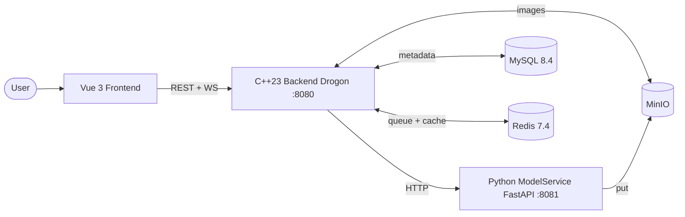

# ZImage — Distributed Async Image Generation Backend

**English** | [简体中文](./README.zh-CN.md)

Production-style image generation service with end-to-end task orchestration: Vue 3 frontend, C++23 Drogon backend, and Python FastAPI model service. The backend owns auth, task lifecycle, queue coordination, Redis-backed cache, MinIO storage, and WebSocket-based status push. **190 unit tests + integration tests + Docker-based CI.**

## Architecture



Three-tier with a single call direction (Frontend → Backend → ModelService). The backend is the only component that holds business state.

**Task flow:** `POST /api/images` creates a `queued` task in MySQL, enqueues the task ID to Redis. A worker pool dequeues, atomically claims the task via `UPDATE + subquery`, calls `POST /generate` on ModelService, and persists results. Clients receive status pushes through WebSocket (`/api/ws/images`). Canonical statuses: `queued / pending / generating / success / failed / cancelled / timeout`.

## Engineering Highlights

#### Cache-Aside with version-bump invalidation

List cache keys are indexed by `<userId, version, page, size>`. Write paths call `INCR list_ver:<userId>` to invalidate **all paginations** for that user in O(1) — no SCAN+DEL, which has cursor-semantics issues under concurrent writes. Old keys age out via TTL.

Code: `Backend/src/services/cache_client.cpp::bumpVersion` + `Backend/include/services/image_cache_key.h::listMyKey`

#### Worker lease + automatic expiry recovery

Workers acquire a Redis lease on claim and heartbeat-renew it. If a worker process crashes, the lease expires naturally; a dedicated `leaseExpiryLoop` periodically scans `lease_expires_at < now` tasks. Within retry budget → requeue. Over budget → mark `timeout`. Single Redis + single MySQL, no external coordinator needed.

Code: `Backend/src/services/task_engine.cpp::leaseExpiryLoop` + `Backend/src/database/ImageRepo.cpp::expireLeasesReturningExpired`

#### Atomic task claim (UPDATE + inline subquery)

A naive "SELECT oldest queued + UPDATE to generating" race allows two workers to claim the same task. The claim is implemented as a **single SQL statement** that updates the row returned by an inline subquery — MySQL row lock makes it atomic.

Code: `Backend/src/database/ImageRepo.cpp::claimNextTask`

#### Layered error model: `RepoError → ServiceError → HTTP`

Repository layer returns `std::expected<T, RepoError>`. `RepoError::Kind` classifies into `DbUnavailable / QueryFailed / ConstraintViolation / Serialization / Internal`. Service layer maps to `ServiceError` (carrying HTTP status) via an explicit `mapRepoError()`. The data layer has zero dependency on Drogon and can be unit-tested standalone.

Code: `Backend/include/database/repo_error.h` + `Backend/src/services/repo_error_mapper.cpp`

#### MinIO connection reuse via `thread_local`

The original implementation reconstructed `BaseUrl + StaticProvider + Client` on every call; a list page with N images triggered N constructions. Now `Client` instances live in a `thread_local unordered_map`, constructed once per thread per backend instance.

Code: `Backend/src/services/minio_client.cpp::ClientBundle::client()`

#### C++23 modern stack throughout

End-to-end error propagation through `std::expected<T, E>` — no `throw` in business code, no out-params, error paths visible at compile time. `std::ranges::views::transform | ranges::to<>` replaces hand-rolled loops in transform/filter pipelines. `std::format` replaces string concatenation. `std::string_view` widened at all read-only parameter boundaries that don't cross third-party APIs.

Code: `Backend/include/database/repo_invoke.h` (centralized exception → RepoError translation) + `Backend/include/controllers/handler_utils.h` (controller-side monadic adapter)

## Design Decisions

#### Cache invalidation: version-bump, not SCAN+DEL

**Trade**: Old cache keys consume memory until their TTL (~60s ceiling, acceptable).
**Gain**: O(1) invalidation, scales linearly to Redis Cluster with zero refactor.
**Why**: SCAN's cursor semantics under concurrent writes don't guarantee catching all matching keys — silent dirty cache. `ICacheClient` deliberately does not expose `delByPattern` to prevent future misuse.

#### Cache-Aside, not Write-Through

**Trade**: Brief inconsistency window (delete-cache failure + concurrent read) is possible.
**Gain**: Write path is simple: update DB, invalidate cache. No two-phase atomicity worries.
**Why**: All keys have TTL ceilings — worst case self-heals within seconds. Write-Through's atomic-dual-write complexity isn't worth it for this consistency target.

#### Five `I*` interfaces exist for testability, not for "future implementations"

`IImageRepo / IUserRepo / ICacheClient / IImageStorage / IHttpClient` exist primarily so 190 unit tests can run without MySQL/Redis/MinIO. Not abstractions for hypothetical future swaps (YAGNI), but abstractions for actually-existing test seams (concrete value today). Fakes use a `next_error` field for fault injection.

Code: `Backend/tests/unit/image_service_test_fakes.h`

#### `std::expected<T, E>`, not throw / `optional<T>` / out-params

**Trade**: Slight boilerplate at every error site (`return std::unexpected(...)`); adapters needed at boundaries with legacy-style libraries.
**Gain**: Error paths visible in the signature; compiler forces callers to handle them; zero runtime overhead.
**Why**: `optional<T>` can't express *why* something is missing. Out-params hide which arguments mutate. Exceptions have unbounded cost on hot paths — and worse, you can't tell from the signature what might throw.

## API Reference

### Auth

- `POST /api/auth/register`
- `POST /api/auth/login`
- Authenticated image APIs use `Authorization: Bearer <token>`
- Users have a `role` field; promote initial admin via SQL:
  ```sql
  UPDATE users SET role = 'admin' WHERE username = '<your_username>';
  ```
  The promoted user must re-login to refresh the JWT payload.

### Image Tasks

- `POST /api/images` — create
- `GET /api/images/my-list` — list current user's tasks
- `GET /api/images/my-list/status/{status}` — list by status
- `GET /api/images/{id}` — get task detail
- `GET /api/images/{id}/status` — get task status (lightweight)
- `POST /api/images/{id}/cancel` — cancel
- `POST /api/images/{id}/retry` — retry
- `GET /api/images/{id}/binary` — download image binary (auth-protected)
- `DELETE /api/images/{id}` — delete task record

### Health & Metrics

- `GET /health` — backend liveness
- `GET /api/images/health` — backend-proxied model service health
- `GET http://<model-service-host>:8081/health` — model service direct
- `GET /api/metrics/cache` — admin-only cache hit/miss/degraded counters per namespace

`ModelService` health states: `healthy` (loaded, idle) / `busy` (loaded, generating) / `loading` (alive, still initializing) / `unhealthy` (failed). The health response also exposes `active_kind` (`none / generate / edit`) so the backend can route work without conflicting with an in-progress job.

## Repository Layout

- `ZImageFrontend/src/`: pages, components, router, Pinia stores, API wrappers
- `Backend/src/controllers/`: HTTP controllers + `handler_utils` (shared JSON/auth/error envelope)
- `Backend/src/services/`: business logic, task engine, cache layer, generation client
- `Backend/src/database/`: MySQL access, repositories, `RepoError` + classification
- `Backend/src/models/`: task and storage data models
- `Backend/include/`: public headers mirroring `src/`
- `Backend/tests/unit/` + `tests/integration/`: gtest test suites
- `ModelService/model_service.py`: FastAPI model-service entrypoint
- `ModelService/main.py`: local standalone model script
- `docker-compose.yml` + `docker-compose.prod.yml`: orchestration
- `init-db/`: initial schema + versioned migrations
- `scripts/`: formatting, migration utilities
- `.github/workflows/`: CI pipelines

### Code Tour

Want to drill into a specific topic? Here's where to look:

| Topic | Start here |
|---|---|
| Cache layer + version-bump invalidation | `Backend/src/services/cache_client.cpp` + `include/services/image_cache_key.h` |
| Cache metrics decorator + endpoint | `Backend/src/services/metrics_cache_client.cpp` + `controllers/metrics_controller.cpp` |
| Repo error model + classification | `Backend/include/database/repo_error.h` + `src/database/repo_error.cpp` |
| Repo → Service error mapper | `Backend/src/services/repo_error_mapper.cpp` |
| Worker pool, lease, expiry loop | `Backend/src/services/task_engine.cpp` |
| Atomic task claim SQL | `Backend/src/database/ImageRepo.cpp` (search `claimNextTask`) |
| HTTP handler envelope + `std::expected` adapter | `Backend/include/controllers/handler_utils.h` |
| Dependency-injection test seams | `Backend/tests/unit/image_service_test_fakes.h` |

## Quick Start

### Prerequisites

For Docker deployment (recommended):
- Docker and Docker Compose v2
- Model weights under `ModelService/models/Z-Image-Turbo`

For local development without Docker:
- `VCPKG_ROOT` environment variable pointing to your vcpkg installation
- Node.js 20+, Python 3.11+, CMake 3.21+
- Running MySQL, Redis, and MinIO instances

### Docker Compose

```bash
cp .env.example .env
# edit .env and replace every CHANGE_ME_* value before shared or deployed use
vim .env

# ensure model weights are in place
ls ModelService/models/Z-Image-Turbo

docker compose up --build
```

For a brand-new MySQL volume, `init-db/01-schema.sql` creates the latest schema and records the current migration baseline automatically.

For an existing database created before versioned migrations were added, run:

```powershell
docker compose up -d mysql
docker compose --profile ops run --rm db-migrate
```

Generated assets and data:
- MySQL data is stored in the `mysql-data` named volume
- Redis data is stored in the `redis-data` named volume
- backend image files are stored in the `backend-storage` named volume
- model weights are expected under `ModelService/models/`

### Model Service

```powershell
cd ModelService
python model_service.py
```

### Backend

```powershell
cd Backend
cmake --preset x64-debug
cmake --build out\build\x64-debug --config Debug
.\out\build\x64-debug\Debug\Backend.exe
```

### Frontend

```powershell
cd ZImageFrontend
npm install
npm run dev
```

The Vite dev server proxies `/api` and `/health` to the backend. By default it uses
`BACKEND_PORT` from the repository root `.env` and targets `http://127.0.0.1:<BACKEND_PORT>`.
Use `ZImageFrontend/.env.local` or shell environment variables to override:

```powershell
$env:VITE_BACKEND_PROXY_TARGET = "http://127.0.0.1:8082"
$env:VITE_HEALTH_PROXY_TARGET = "http://127.0.0.1:8082"
npm run dev
```

When running the backend in Docker but the model service directly on Windows, set the backend
model-service URL to the host gateway and recreate the backend container:

```powershell
PYTHON_SERVICE_URL=http://host.docker.internal:8081
```

### VSCode Workflow

If you open the repository root in VSCode, use these commands:

- `CMake: Select Configure Preset` -> `x64-debug`
- `CMake: Delete Cache and Reconfigure` after toolchain changes
- `CMake: Build` to build the backend
- start frontend and model service from the integrated terminal with the commands above
- local `tasks.json` / `launch.json` can be added per developer if you want one-click run or debugging

### Formatting

Formatting is standardized by:

- `.editorconfig`
- `.clang-format`
- `.prettierrc.json`
- `pyproject.toml`

Run formatting with:

```powershell
powershell -ExecutionPolicy Bypass -File .\scripts\format.ps1
```

```bash
bash ./scripts/format.sh
```

Check formatting without rewriting files:

```powershell
powershell -ExecutionPolicy Bypass -File .\scripts\format.ps1 -Check
```

```bash
bash ./scripts/format.sh check
```

Required tools:

- `clang-format`
- `node` / `npx`
- `python` plus `black` and `ruff`

### CI Baseline

The repository includes `.github/workflows/ci.yml` with a lightweight default pipeline:

- frontend: `npm ci` + `npm run build`
- backend: Docker-based Linux build that runs `UnitTests` and `IntegrationTests`
- model service: Python entrypoint compile smoke check
- docker: `docker compose config` plus runtime image builds for `Backend/` and `ZImageFrontend/`

Heavyweight model-image validation is intentionally split into `.github/workflows/model-service-image.yml`, so the default CI stays stable and reasonably fast.

## Configuration

### Backend

Copy the example config and fill in your local values:

```powershell
cp Backend/config.json.example Backend/config.json
# edit Backend/config.json with your database password, JWT secret, etc.
```

Primary files:
- `Backend/config.json`
- `.env.example` for Docker Compose defaults

Important settings:

- `server`: host, port, thread count
- `database`: MySQL connection, optional SSL mode, and pool settings
- `jwt`: secret and token expiration
- `python_service`: model-service URL and execution timeout
- `task_engine`: worker count, polling, lease, retry policy
- `redis`: queue coordination, lease keys, timeouts, and enable switch
- `storage`: local image storage settings

Environment-variable overrides are supported in the backend for common settings such as:

- `BACKEND_PORT`
- `DB_HOST` `DB_PORT` `DB_USERNAME` `DB_PASSWORD` `DB_NAME` `DB_SSL`
- `JWT_SECRET`
- `PYTHON_SERVICE_URL` `PYTHON_SERVICE_TIMEOUT_SECONDS`
- `REDIS_ENABLED` `REDIS_HOST` `REDIS_PORT` `REDIS_PASSWORD` `REDIS_DB`
- `REDIS_POOL_SIZE` `REDIS_CONNECT_TIMEOUT_MS` `REDIS_SOCKET_TIMEOUT_MS`
- `REDIS_TASK_QUEUE_KEY` `REDIS_LEASE_KEY_PREFIX`
- `STORAGE_ROOT_DIR` `STORAGE_PUBLIC_URL_PREFIX` `STORAGE_EXTENSION`

The backend is now container-friendly in two ways:
- Docker image builds include `/app/config.json` from `Backend/config.json.example`, so the container always has a file-based baseline config
- `BACKEND_CONFIG_PATH` can point to a mounted config file when you want to override that baseline config

### Model Service

Key environment variables:

- `MODEL_SERVICE_PORT`
- `MODEL_PATH`
- `MODEL_SERVICE_ALLOW_ORIGINS`
- `MODEL_SERVICE_LOG_DIR`
- `MODEL_SERVICE_TEMP_DIR`
- `MODEL_SERVICE_MAX_CONCURRENT_GENERATIONS`
- `MODEL_SERVICE_TEMP_FILE_MAX_AGE_HOURS`
- `MODEL_SERVICE_TEMP_FILE_CLEANUP_INTERVAL_SECONDS`

Default container-oriented paths now assume:
- model weights: `./models/Z-Image-Turbo` or a mounted path provided through `MODEL_PATH`
- temp files: `./temp`
- logs: `./logs`

### Docker Preparation

The repository includes:
- `.env.example` with service-to-service defaults for containers
- `.env.production.example` as a production-only template with secret placeholders, replica counts, and resource limits
- `.dockerignore` files at the repository root and per service
- `docker-compose.yml` to orchestrate MySQL, Redis, MinIO, Backend, ModelService, Frontend, and the optional `db-migrate` utility service
- `docker-compose.prod.yml` for production-oriented resource limits, log rotation, and replica defaults
- `init-db/01-schema.sql` for first-run MySQL schema initialization
- `init-db/migrations/*.sql` plus `scripts/run-db-migrations.sh` for versioned schema upgrades on existing databases
- Dockerfiles for `Backend/`, `ModelService/`, and `ZImageFrontend/`
- `ZImageFrontend/nginx.conf` for SPA hosting plus backend/API/WebSocket reverse proxy, gzip, and baseline security headers
- `ModelService/requirements.txt` for Python image builds
- frontend dev proxy targets configurable via `VITE_BACKEND_PROXY_TARGET` and `VITE_HEALTH_PROXY_TARGET`
- GitHub Actions CI for frontend build, backend tests, and Docker validation
- dedicated model-service image workflow for heavyweight runtime image builds

### Database Migrations

Versioned database migrations live under `init-db/migrations/`:

- `001_initial_schema.sql`: legacy baseline schema
- `002_image_generation_task_queue.sql`: task-engine lease, retry, and worker columns plus supporting indexes

Operational notes:

- fresh `docker compose up` runs `init-db/01-schema.sql` and records `001` + `002` + `003` + `004` in `schema_migrations`
- the backend still keeps its existing startup-time defensive column/index checks for `image_generations`, but versioned migrations are now the primary upgrade path
- existing databases should be upgraded with `docker compose --profile ops run --rm db-migrate`
- when adding a new migration file, also fold that change into `init-db/01-schema.sql` and append the new version to its baseline `schema_migrations` insert for fresh installs

### Production Compose

Recommended production flow:

```powershell
copy .env.production.example .env.production
# replace every CHANGE_ME_* placeholder before deployment
docker compose --env-file .env.production -f docker-compose.yml -f docker-compose.prod.yml up -d --build
```

Notes:

- `docker-compose.prod.yml` sets CPU and memory limits plus container log rotation defaults
- `deploy.replicas` values are provided for backend, frontend, and model-service; if your local Compose setup ignores them, use `docker compose up --scale <service>=<count>` with the same env file

## What I'd Do Differently

These are conscious trade-offs given the current scope (single-instance deployment, demo-grade load) — open work, not unfinished homework:

- **HTTP client retry / circuit breaker against ModelService.** Today `GenerationClient` calls the model service directly; a ModelService hiccup propagates straight to the caller. Next iteration: exponential-backoff retry + circuit breaker (probably swapping in `cpr` since Drogon's HTTP client is bare-bones for this use case).
- **Request-level observability.** Only cache metrics are surfaced today. For production I'd add Prometheus-format exporters for request latency p50/p99, error rate by endpoint, and outbound ModelService call duration — plus distributed tracing (OTel) across the three tiers.
- **Cache stampede protection at scale.** The plan called for in-process `singleflight` (mutex + `shared_future` per key) to coalesce concurrent misses on the same list key. Skipped because of single-instance assumptions; multi-instance deployment would want Redis `SET NX` as a distributed lock instead.
- **Backend horizontal scaling.** Worker pool + task queue are already distributable via Redis. WebSocket push isn't — task status broadcasts through an in-process `TaskEventHub`; multi-instance needs Redis pub/sub or a sticky-session strategy.
- **End-to-end test pipeline.** Unit tests (190 cases) cover business logic; integration tests hit a real MySQL. But there's no Playwright/Cypress-driven full-stack scenario test (create task → poll → final image rendered correctly).
- **Secrets management.** `.env.production` works for solo deployment but doesn't scale. A real secrets manager (Vault, AWS SSM, etc.) is the next step beyond env vars.

## Security Notes

- do not commit real secrets or production passwords
- `Backend/config.json` is gitignored — use `Backend/config.json.example` as the template
- replace every `CHANGE_ME_*` placeholder in `.env` or `.env.production` before any shared or deployed usage
- keep internal-only services such as MySQL and Redis on trusted networks even when using the production compose override
