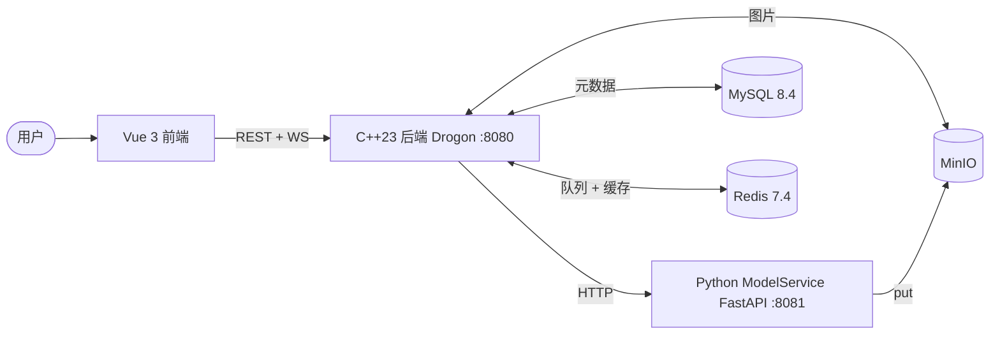

# ZImage — 分布式异步图像生成后端

[English](./README.md) | **简体中文**

生产级别架构的图像生成系统，端到端任务编排：Vue 3 前端、C++23 Drogon 后端、Python FastAPI 模型服务。后端承担鉴权、任务生命周期、队列协调、Redis 缓存层、MinIO 存储以及 WebSocket 状态推送。**190 个单元测试 + 集成测试 + 基于 Docker 的 CI。**

## 架构



三层架构、单向调用（Frontend → Backend → ModelService）。后端是唯一持有业务状态的组件。

**任务流：** `POST /api/images` 在 MySQL 中创建 `queued` 任务并把 task ID 入队 Redis。Worker 池从 Redis 取任务，通过 `UPDATE + 子查询` 原子认领，调用 ModelService 的 `POST /generate`，再持久化结果。客户端通过 WebSocket（`/api/ws/images`）接收状态推送。规范化任务状态：`queued / pending / generating / success / failed / cancelled / timeout`。

## 工程亮点

#### Cache-Aside + 版本号失效

列表缓存按 `<userId, version, page, size>` 索引，写路径通过 `INCR list_ver:<userId>` 在 **O(1)** 内作废该用户所有分页。**不走 SCAN+DEL** —— 后者在并发写入下游标语义不保证抓全所有 key。旧 key 由 TTL 自然过期。

代码位置：`Backend/src/services/cache_client.cpp::bumpVersion` + `Backend/include/services/image_cache_key.h::listMyKey`

#### Worker lease + 自动过期回收

Worker 抢到任务后获取 Redis lease 并心跳续期；进程崩溃后 lease 自然过期，独立的 `leaseExpiryLoop` 周期性扫描 `lease_expires_at < now` 的任务，retry 预算内 → requeue，超过预算 → 标 `timeout`。**单 Redis + 单 MySQL 实现"workers crash 后任务不丢"**，无需外部协调器。

代码位置：`Backend/src/services/task_engine.cpp::leaseExpiryLoop` + `Backend/src/database/ImageRepo.cpp::expireLeasesReturningExpired`

#### 原子任务认领（UPDATE + 内嵌子查询）

朴素的"SELECT 最老 queued + UPDATE 到 generating"在多 worker 下会让两个 worker 同时抢到同一任务。这里改成**单条 SQL 语句**：UPDATE 修改 inline subquery 返回的那一行，由 MySQL 行锁保证原子性。

代码位置：`Backend/src/database/ImageRepo.cpp::claimNextTask`

#### 分层错误模型：`RepoError → ServiceError → HTTP`

Repo 层返回 `std::expected<T, RepoError>`，`RepoError::Kind` 分类为 `DbUnavailable / QueryFailed / ConstraintViolation / Serialization / Internal` 五类。Service 层通过显式 `mapRepoError()` 映射成带 HTTP 状态码的 `ServiceError`。**数据层完全不依赖 Drogon**，可独立单测。

代码位置：`Backend/include/database/repo_error.h` + `Backend/src/services/repo_error_mapper.cpp`

#### MinIO 客户端连接复用（`thread_local`）

最初的实现每次 `presignUrl` / `getObject` 都要重新构造 `BaseUrl + StaticProvider + Client`；列表页 N 张图触发 N 次构造。改造后 Client 实例驻留在 `thread_local unordered_map` 中，每个线程仅构造一次。

代码位置：`Backend/src/services/minio_client.cpp::ClientBundle::client()`

#### 全栈 C++23 现代化

端到端用 `std::expected<T, E>` 传播错误 —— 业务代码内 **无 `throw`、无 out-param、错误路径在编译期可见**。`std::ranges::views::transform | ranges::to<>` 替代手写 transform/filter 循环；`std::format` 替代字符串拼接；`std::string_view` 应用于所有不跨第三方 API 边界的只读参数。

代码位置：`Backend/include/database/repo_invoke.h`（异常 → RepoError 集中翻译）+ `Backend/include/controllers/handler_utils.h`（Controller 侧的 monadic 风格适配器）

## 设计取舍

#### 缓存失效用版本号，不用 SCAN+DEL

**代价**：旧 cache key 占内存到 TTL 过期（~60s 上限，可接受）。
**收益**：O(1) 失效；扩展到 Redis Cluster 零成本。
**理由**：SCAN 的游标语义在并发写入下不保证抓全匹配 key —— 留下静默的脏缓存。`ICacheClient` 故意不暴露 `delByPattern`，避免后续开发者滥用。

#### Cache-Aside，不是 Write-Through

**代价**：删缓存失败 + 并发读取的极端情况会有秒级不一致。
**收益**：写路径只更新 DB 再失效缓存，无双写原子性顾虑。
**理由**：所有 key 都有 TTL 兜底，最坏情况秒级自愈。Write-Through 的双写原子性在这个一致性目标下不值得。

#### 5 个 `I*` 接口是为了测试，而不是"将来换实现"

`IImageRepo / IUserRepo / ICacheClient / IImageStorage / IHttpClient` 的存在主要是为了让 190 个单测在不起 MySQL/Redis/MinIO 的情况下完整覆盖业务路径。不是为假想未来的实现切换做抽象（YAGNI），而是为今天确实需要的测试可注入点做抽象（实际收益）。Fakes 通过 `next_error` 字段做故障注入。

代码位置：`Backend/tests/unit/image_service_test_fakes.h`

#### `std::expected<T, E>`，不用 throw / `optional<T>` / out-param

**代价**：每个错误站点要写 `return std::unexpected(...)`，和老 C++ 风格库交互需要适配器。
**收益**：错误路径在函数签名里可见；编译器强制调用方处理；零运行时开销。
**理由**：`optional<T>` 表达不了"为什么没值"；out-param 看代码不知道哪个参数会被修改；exception 在热路径开销不可控 —— 更糟的是签名上看不出来什么时候会抛。

## API 参考

### 鉴权

- `POST /api/auth/register`
- `POST /api/auth/login` — 返回 `access_token`、`refresh_token` 与 `expires_in`（默认 900 秒）
- `POST /api/auth/refresh` — rotate refresh token，并返回新的 token pair
- `POST /api/auth/logout` — 撤销提交的 refresh token
- `GET /api/auth/me` — 当前用户资料
- `PUT /api/auth/password` — 修改密码，并撤销该用户所有 refresh token
- 鉴权 API 使用 `Authorization: Bearer <access_token>`
- 用户有 `role` 字段；通过 SQL 提升初始 admin：
  ```sql
  UPDATE users SET role = 'admin' WHERE username = '<your_username>';
  ```
  提升后用户需重新登录以刷新 JWT payload。

### 图像任务

- `POST /api/images` — 创建任务
- `GET /api/images/my-list` — 列出当前用户的任务
- `GET /api/images/my-list/status/{status}` — 按状态列出
- `GET /api/images/{id}` — 任务详情
- `GET /api/images/{id}/status` — 轻量状态查询
- `POST /api/images/{id}/cancel` — 取消任务
- `POST /api/images/{id}/retry` — 重试
- `GET /api/images/{id}/binary` — 下载图片二进制（鉴权保护）
- `DELETE /api/images/{id}` — 删除任务记录

### 健康检查 & 监控

- `GET /health` — 后端 liveness
- `GET /api/images/health` — 后端代理的模型服务健康
- `GET http://<model-service-host>:8081/health` — 模型服务直查
- `GET /metrics` — Backend Prometheus 文本指标，覆盖请求延迟、任务状态迁移、队列深度、DB gauge、ModelService 出站调用
- `GET /api/metrics/cache` — admin 专属，按 namespace 输出缓存 hit/miss/degraded 计数
- `GET http://<model-service-host>:8081/metrics` — ModelService Prometheus 指标，覆盖健康状态、生成耗时、活跃任务和 GPU 显存

`ModelService` 健康状态：`healthy`（已加载、空闲）/ `busy`（已加载、生成中）/ `loading`（进程存活、模型加载中）/ `unhealthy`（不可用或超过 `MODEL_SERVICE_BUSY_UNHEALTHY_SECONDS` 仍未结束）。健康响应还包含 `active_kind`（`none / generate / edit`）和活跃任务计数，让后端主动退避，不再持有 worker lease 等到超时。

## 仓库结构

- `ZImageFrontend/src/`：页面、组件、路由、Pinia store、API 包装
- `Backend/src/controllers/`：HTTP controllers + `handler_utils`（共享的 JSON/鉴权/错误信封）
- `Backend/src/services/`：业务逻辑、任务引擎、缓存层、模型服务调用
- `Backend/src/database/`：MySQL 访问、Repos、`RepoError` + 分类
- `Backend/src/models/`：任务与存储数据模型
- `Backend/include/`：公共头文件，镜像 `src/`
- `Backend/tests/unit/` + `tests/integration/`：gtest 测试套件
- `ModelService/model_service.py`：FastAPI 模型服务入口
- `ModelService/main.py`：本地独立运行脚本
- `docker-compose.yml` + `docker-compose.prod.yml`：服务编排
- `init-db/`：初始 schema + 版本化 migrations
- `scripts/`：格式化、迁移工具
- `.github/workflows/`：CI 流水线

### 代码导览

想直接看某个具体话题？这里是入口：

| 主题 | 起点文件 |
|---|---|
| 缓存层 + 版本号失效 | `Backend/src/services/cache_client.cpp` + `include/services/image_cache_key.h` |
| 缓存指标 decorator + endpoint | `Backend/src/services/metrics_cache_client.cpp` + `controllers/metrics_controller.cpp` |
| Repo 错误模型 + 分类 | `Backend/include/database/repo_error.h` + `src/database/repo_error.cpp` |
| Repo → Service 错误映射 | `Backend/src/services/repo_error_mapper.cpp` |
| Worker 池 / lease / 过期循环 | `Backend/src/services/task_engine.cpp` |
| 原子任务认领 SQL | `Backend/src/database/ImageRepo.cpp`（搜 `claimNextTask`） |
| HTTP handler 信封 + `std::expected` 适配 | `Backend/include/controllers/handler_utils.h` |
| 依赖注入测试 seam | `Backend/tests/unit/image_service_test_fakes.h` |

## 快速开始

### 前置要求

Docker 部署（推荐）：
- Docker 和 Docker Compose v2
- 模型权重放在 `ModelService/models/Z-Image-Turbo`

本地开发（无 Docker）：
- `VCPKG_ROOT` 环境变量指向 vcpkg 安装目录
- Node.js 20+、Python 3.11+、CMake 3.21+
- 运行中的 MySQL、Redis、MinIO 实例

### Docker Compose

```bash
cp .env.example .env
# 在共享或部署前，把 .env 中所有 CHANGE_ME_* 替换成真实值
vim .env

# 确认模型权重就位
ls ModelService/models/Z-Image-Turbo

docker compose up --build
```

对全新的 MySQL volume，`init-db/01-schema.sql` 会创建最新 schema 并自动记录基线 migration 版本。

对升级 versioned migrations 之前就存在的数据库，运行：

```powershell
docker compose up -d mysql
docker compose --profile ops run --rm db-migrate
```

生成的数据：
- MySQL 数据存储在 `mysql-data` 命名 volume
- Redis 数据存储在 `redis-data` 命名 volume
- 后端图片文件存储在 `backend-storage` 命名 volume
- 模型权重位于 `ModelService/models/`

### 模型服务

```powershell
cd ModelService
python model_service.py
```

### 后端

```powershell
cd Backend
cmake --preset x64-debug
cmake --build out\build\x64-debug --config Debug
.\out\build\x64-debug\Debug\Backend.exe
```

### 前端

```powershell
cd ZImageFrontend
npm install
npm run dev
```

Vite 开发服务器把 `/api` 和 `/health` 代理到后端。默认读取根目录 `.env` 的 `BACKEND_PORT`，指向 `http://127.0.0.1:<BACKEND_PORT>`。通过 `ZImageFrontend/.env.local` 或 shell 环境变量覆盖：

```powershell
$env:VITE_BACKEND_PROXY_TARGET = "http://127.0.0.1:8082"
$env:VITE_HEALTH_PROXY_TARGET = "http://127.0.0.1:8082"
npm run dev
```

如果后端在 Docker 跑、模型服务直接跑在 Windows 主机上，将后端的模型服务 URL 指向 host gateway 并重建后端容器：

```powershell
PYTHON_SERVICE_URL=http://host.docker.internal:8081
```

### VSCode 工作流

如果用 VSCode 打开仓库根目录：

- `CMake: Select Configure Preset` -> `x64-debug`
- 工具链改动后 `CMake: Delete Cache and Reconfigure`
- `CMake: Build` 构建后端
- 在集成终端用上面的命令启动前端和模型服务
- 一键运行/调试可按开发者本地加 `tasks.json` / `launch.json`

### 代码格式化

格式化规范来自：

- `.editorconfig`
- `.clang-format`
- `.prettierrc.json`
- `pyproject.toml`

执行格式化：

```powershell
powershell -ExecutionPolicy Bypass -File .\scripts\format.ps1
```

```bash
bash ./scripts/format.sh
```

仅检查、不改写：

```powershell
powershell -ExecutionPolicy Bypass -File .\scripts\format.ps1 -Check
```

```bash
bash ./scripts/format.sh check
```

所需工具：

- `clang-format`
- `node` / `npx`
- `python` 配合 `black` 和 `ruff`

### CI 流水线

仓库包含 `.github/workflows/ci.yml`，默认轻量级流水线：

- frontend：`npm ci` + `npm run build`
- backend：基于 Docker 的 Linux 构建，跑 `UnitTests` 和 `IntegrationTests`
- model service：Python entrypoint 编译 smoke check + mock 后的 FastAPI pytest 测试
- docker：`docker compose config` + `Backend/` 和 `ZImageFrontend/` 的运行时镜像构建

重量级的模型镜像验证拆到独立的 `.github/workflows/model-service-image.yml`，让默认 CI 稳定且足够快。

## 配置

### 后端

复制示例配置并填入本地值：

```powershell
cp Backend/config.json.example Backend/config.json
# 在 Backend/config.json 中填入数据库密码、JWT secret 等
```

主要文件：
- `Backend/config.json`
- `.env.example`（Docker Compose 默认值）

重要配置项：

- `server`：host、port、线程数
- `database`：MySQL 连接、可选 SSL、连接池
- `jwt`：secret、access token TTL、refresh token TTL
- `python_service`：模型服务 URL、执行超时
- `task_engine`：worker 数、轮询、lease、重试策略
- `cors`：允许访问 Backend API 的浏览器来源
- `redis`：队列协调、lease key、超时、启用开关
- `rate_limit`：Redis token bucket 限流和活跃任务配额
- `storage`：本地图片存储

后端支持以下环境变量覆盖：

- `BACKEND_PORT`
- `DB_HOST` `DB_PORT` `DB_USERNAME` `DB_PASSWORD` `DB_NAME` `DB_SSL`
- `CORS_ENABLED` `CORS_ALLOW_ORIGINS`
- `JWT_SECRET` `JWT_ACCESS_EXPIRATION_MINUTES` `JWT_REFRESH_EXPIRATION_DAYS`
- `PYTHON_SERVICE_URL` `PYTHON_SERVICE_TIMEOUT_SECONDS`
- `REDIS_ENABLED` `REDIS_HOST` `REDIS_PORT` `REDIS_PASSWORD` `REDIS_DB`
- `REDIS_POOL_SIZE` `REDIS_CONNECT_TIMEOUT_MS` `REDIS_SOCKET_TIMEOUT_MS`
- `REDIS_TASK_QUEUE_KEY` `REDIS_LEASE_KEY_PREFIX`
- `RATE_LIMIT_ENABLED` `RATE_LIMIT_FAIL_OPEN` `RATE_LIMIT_MAX_ACTIVE_TASKS_PER_USER`
- `RATE_LIMIT_USER_CREATE_CAPACITY` `RATE_LIMIT_USER_CREATE_WINDOW_SECONDS`
- `RATE_LIMIT_AUTH_IP_CAPACITY` `RATE_LIMIT_AUTH_IP_WINDOW_SECONDS` `RATE_LIMIT_KEY_PREFIX`
- `STORAGE_ROOT_DIR` `STORAGE_PUBLIC_URL_PREFIX` `STORAGE_EXTENSION`

如果设置了文件型 secret 变量，后端会优先读取：
`DB_PASSWORD_FILE`、`JWT_SECRET_FILE`、`REDIS_PASSWORD_FILE`、`CACHE_PASSWORD_FILE`、
`MINIO_SECRET_KEY_FILE`。文件不存在或为空时，启动会给出包含变量名和路径的明确错误。

后端的容器友好性体现在两点：
- Docker 镜像构建时把 `Backend/config.json.example` 复制为 `/app/config.json`，容器内总有基线配置
- `BACKEND_CONFIG_PATH` 可以指向挂载的配置文件，覆盖基线配置

### 模型服务

关键环境变量：

- `MODEL_SERVICE_PORT`
- `MODEL_PATH`
- `MODEL_SERVICE_ALLOW_ORIGINS`
- `MODEL_SERVICE_LOG_DIR`
- `MODEL_SERVICE_TEMP_DIR`
- `MODEL_SERVICE_MAX_CONCURRENT_GENERATIONS`
- `MODEL_SERVICE_BUSY_UNHEALTHY_SECONDS`
- `MODEL_SERVICE_TEMP_FILE_MAX_AGE_HOURS`
- `MODEL_SERVICE_TEMP_FILE_CLEANUP_INTERVAL_SECONDS`

生产环境设置 `ENV=production`、`CORS_ALLOW_ORIGINS=https://<your-domain>`、`MODEL_SERVICE_ALLOW_ORIGINS=https://<your-domain>`。如果生产 CORS 包含 `*`、`localhost`、`127.0.0.1`、`[::1]` 或 `0.0.0.0`，启动会 fail-fast。

默认（容器友好）路径：
- 模型权重：`./models/Z-Image-Turbo` 或通过 `MODEL_PATH` 提供的挂载路径
- 临时文件：`./temp`
- 日志：`./logs`

### Docker 配套

仓库包含：
- `.env.example`：容器间通信的默认配置
- `.env.production.example`：生产环境模板，含 Docker secret 文件引用、副本数、资源限制
- `.dockerignore`：根目录和各服务目录都有
- `docker-compose.yml`：编排 MySQL、Redis、MinIO、Backend、ModelService、Frontend，可选的 `db-migrate` 工具服务
- `docker-compose.prod.yml`：生产级资源限制、日志轮转、副本数默认值
- `init-db/01-schema.sql`：首次启动的 MySQL schema 初始化
- `init-db/migrations/*.sql` + `scripts/run-db-migrations.sh`：对已有数据库的版本化 schema 升级
- `Backend/`、`ModelService/`、`ZImageFrontend/` 的 Dockerfile
- `ZImageFrontend/nginx.conf`：SPA 托管 + backend/API/WebSocket 反向代理 + gzip + 基线安全头
- `ModelService/requirements.txt`：Python 镜像构建
- 前端 dev proxy 可通过 `VITE_BACKEND_PROXY_TARGET` 和 `VITE_HEALTH_PROXY_TARGET` 配置
- GitHub Actions CI：前端构建、后端测试、Docker 验证
- 独立的 model-service 镜像 workflow（重量级运行时镜像构建）

### 数据库迁移

版本化数据库迁移在 `init-db/migrations/`：

- `001_initial_schema.sql`：基线 legacy schema
- `002_image_generation_task_queue.sql`：task-engine 的 lease、retry、worker 列，以及对应索引

操作说明：

- 全新 `docker compose up` 执行 `init-db/01-schema.sql` 并在 `schema_migrations` 表中记录 `001` + `002` + `003` + `004`
- 后端启动时仍会做防御性的列/索引检查（针对 `image_generations`），但版本化 migrations 是主要升级路径
- 已有数据库通过 `docker compose --profile ops run --rm db-migrate` 升级
- 新增 migration 文件时，同时把变更折进 `init-db/01-schema.sql`，并把新版本号追加到基线 `schema_migrations` insert，保证全新安装一致

### 生产 Compose

推荐生产流程：

```powershell
copy .env.production.example .env.production
# 部署前替换非 secret 的 CHANGE_ME_* 占位符，尤其是 DOMAIN 和 ACME_EMAIL
docker compose --env-file .env.production -f docker-compose.yml -f docker-compose.prod.yml up -d --build
```

说明：

- 生产 secret 通过 Docker Secrets 挂载，再由 `*_FILE` 变量引用，例如
  `/run/secrets/jwt_secret`。不要把真实 secret 写入 `.env.production`；该文件只保留
  secret 文件路径、secret 名称、域名、端口和资源配置。
- 单机 Docker 部署时，首次启动前先初始化 Swarm（如尚未初始化）并创建 secrets：
  ```bash
  docker swarm init
  printf '%s' '<jwt-secret>' | docker secret create zimage_jwt_secret -
  printf '%s' '<db-password>' | docker secret create zimage_db_password -
  printf '%s' '<mysql-root-password>' | docker secret create zimage_mysql_root_password -
  printf '%s' '<redis-password>' | docker secret create zimage_redis_password -
  printf '%s' '<minio-password>' | docker secret create zimage_minio_password -
  printf '%s' '<backup-s3-access-key>' | docker secret create zimage_backup_s3_access_key -
  printf '%s' '<backup-s3-secret-key>' | docker secret create zimage_backup_s3_secret_key -
  printf '%s' '<grafana-admin-password>' | docker secret create zimage_grafana_admin_password -
  chmod 600 .env.production
  ```
- `docker-compose.prod.yml` 在 80/443 端口前置 Traefik。生产 overlay 会清掉基础 compose 中应用服务和内部依赖服务的宿主机端口映射，公网流量只应从 HTTPS 进入。
- 首次签发证书前，把 `DOMAIN` 的 DNS `A` 记录指向部署机公网 IP。
- 启动前在部署机创建 ACME 存储文件：
  ```bash
  mkdir -p traefik
  touch traefik/acme.json
  chmod 600 traefik/acme.json
  ```
- 第一次联调保留 `TRAEFIK_ACME_CA_SERVER=https://acme-staging-v02.api.letsencrypt.org/directory`。确认 `https://$DOMAIN` 和 `https://$DOMAIN/api/health` 可用后，再切到正式端点 `https://acme-v02.api.letsencrypt.org/directory`。
- 生产验收用 `curl -vk https://$DOMAIN`、`curl https://$DOMAIN/api/health`、`curl -I http://$DOMAIN`、SSL Labs，以及 `wss://$DOMAIN/api/ws/images` 客户端检查。
- `ops` profile 包含 `mysql-backup` 和 `mc-mirror`，用于定时 MySQL dump、binlog 归档和 S3 兼容 MinIO 镜像；见 [备份与恢复 Runbook](docs/runbook-backup-restore.md)。
- `monitoring` profile 会启动默认只绑定本机回环地址的 Prometheus 和 Grafana：
  ```bash
  docker compose --env-file .env.production -f docker-compose.yml -f docker-compose.prod.yml --profile monitoring up -d prometheus grafana
  ```
  Prometheus 抓取 `backend:8080/metrics` 和 `model-service:8081/metrics`；Grafana 自动加载 `monitoring/dashboards/zimage.json`。
- `docker-compose.prod.yml` 设置 CPU/内存限制 + 容器日志轮转
- `deploy.replicas` 已经在 backend、frontend、model-service 上配置；如果本地 Compose 不支持该字段，用 `docker compose up --scale <service>=<count>` 配合同样的 env 文件

## 不完美之处

当前作用域是单实例部署、demo 级负载，以下都是有意识的取舍 —— **开放工作项，不是没做完的作业**：

- **HTTP client 重试 / 熔断（对 ModelService）。** 当前 `GenerationClient` 直连模型服务；ModelService 抖动直接传播到调用方。下个版本：指数退避重试 + circuit breaker（可能换 `cpr`，因为 Drogon 的 HTTP client 对该场景过于简陋）。
- **分布式追踪。** Prometheus 指标已经覆盖请求延迟、任务状态迁移、队列深度和 ModelService 生成耗时。下一步 observability 是跨 Backend / ModelService 透传 trace ID，并接 OpenTelemetry traces。
- **缓存击穿防护（规模化）。** 计划里写了 in-process `singleflight`（mutex + `shared_future` per key）合并并发 miss。考虑到单实例部署暂时跳过；多实例部署应改用 Redis `SET NX` 做分布式锁。
- **后端横向扩展。** Worker 池 + 任务队列已经能通过 Redis 分发。WebSocket 推送不能 —— 当前任务状态通过进程内 `TaskEventHub` 广播；多实例需要 Redis pub/sub 或 sticky session。
- **端到端测试流水线。** 190 个单测覆盖业务逻辑、integration 测试打真实 MySQL，但没有 Playwright/Cypress 驱动的全栈场景测试（建任务 → 轮询 → 最终图片正确渲染）。
- **跨主机 secrets 管理。** 生产 Compose 已使用 Docker Secrets 与 `*_FILE` 变量。
  Kubernetes 或云上部署应继续迁到 External Secrets、Vault、AWS SSM 或平台原生 secret manager。

## 安全提示

- 不要提交真实 secrets 或生产密码
- `Backend/config.json` 已 gitignore —— 用 `Backend/config.json.example` 作为模板
- 共享 `.env` 前替换其中所有 secret 占位符；生产环境创建 Docker Secrets，`.env.production` 只保留 `*_FILE` 路径和非 secret 配置
- 部署机上的 `.env.production` 权限应限制为 `chmod 600`
- 使用生产 Compose overlay 时，MySQL、Redis、MinIO、ModelService 等内部服务不要直接暴露宿主机公网端口
- 生产环境不要在宿主机防火墙直接开放 backend、frontend、model-service 端口；Traefik 应该是唯一公网 HTTP 入口
